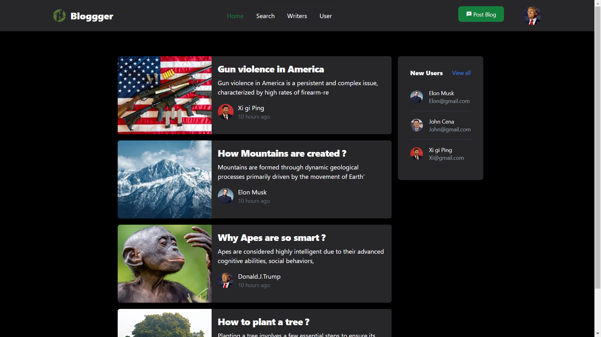
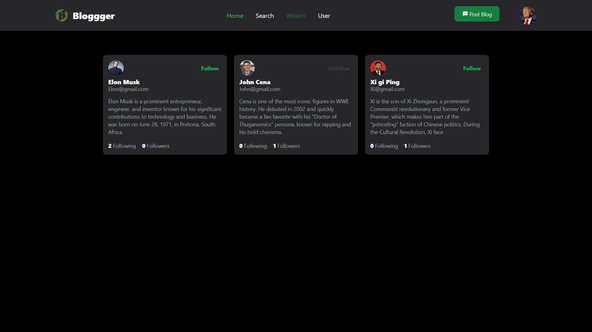
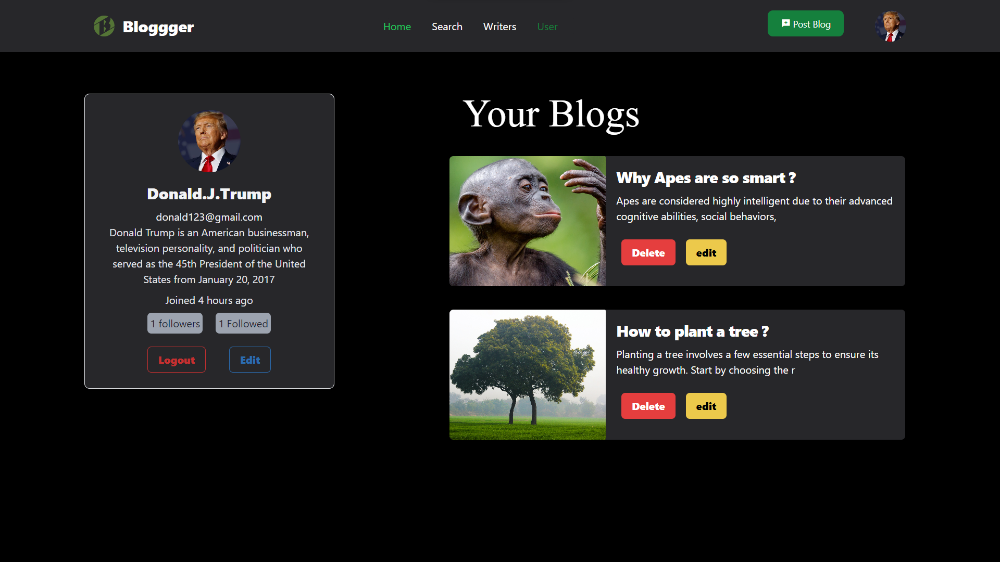

# Blog Website 🌐✍️

Welcome to my Blog Website! This platform allows users to log in, write, and upload their blogs, while others can view and enjoy the content. 🚀

## Features ✨

- User authentication 🔐
- Blog creation, editing, and deletion 📝****
- Image uploads via Cloudinary 📸
- Secure password storage with bcrypt 🔒
- Interactive and responsive frontend with React ⚛️

## Tech Stack 💻

### Backend 🛠️

The backend is built with the following technologies:

- **axios**: `^1.7.9`
- **bcrypt**: `^5.1.1`
- **cloudinary**: `^2.5.1`
- **express**: `^4.21.0`
- **jsonwebtoken**: `^9.0.2`
- **pg**: `^8.12.0`
- **server**: `file:`

### Frontend 🌟

- **React**: For building a dynamic and user-friendly interface.

## Getting Started 🏁

### Prerequisites 🛑

- Node.js installed
- PostgreSQL database configured

### Installation 🔧

1. Clone the repository:
   ```bash
   git clone <repository-url>
   ```
2. Navigate to the project directory:
   ```bash
   cd client
   ```
3. Navigate to the server directory:
   ```bash
   cd server
   ```
4. Run the application:
   ```bash
   npm run dev
   ```

### Environment Variables 📋

#### Backend `.env`
```env
# Database connection
DATABASE_URL=Add your online db url

# Server port
PORT=

# CORS origin
CORS_ORIGIN=*

# JWT authentication
JWT_SECRET=

# Cloudinary configuration
CLOUDINARY_CLOUD_NAME=
CLOUDINARY_API_KEY=
CLOUDINARY_API_SECRET=
```

#### Frontend `.env`
```env
# Cloudinary upload configuration
VITE_CLOUDINARY_UPLOAD_URL=
VITE_CLOUD_NAME=
VITE_CLOUDINARY_UPLOAD_PRESET=
```

## Preview 📸
#### welcome page
  
#### Home page
  
#### Writer page
  
#### User's Page
  
#### Blog Search
  
#### Post blog
  

## Contributing 🤝

Feel free to fork this project, submit issues, or create pull requests. Contributions are welcome!

---

Enjoy creating and exploring blogs on this platform! 🌟

